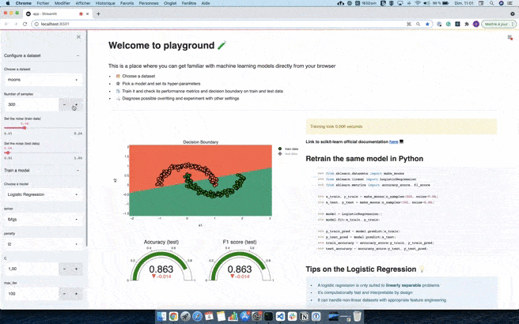
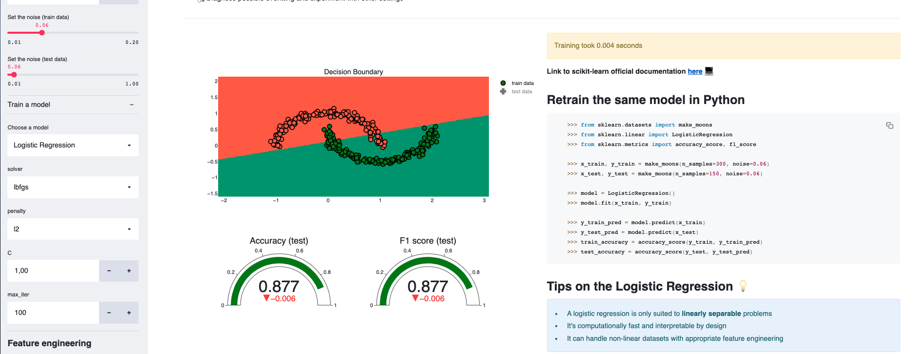
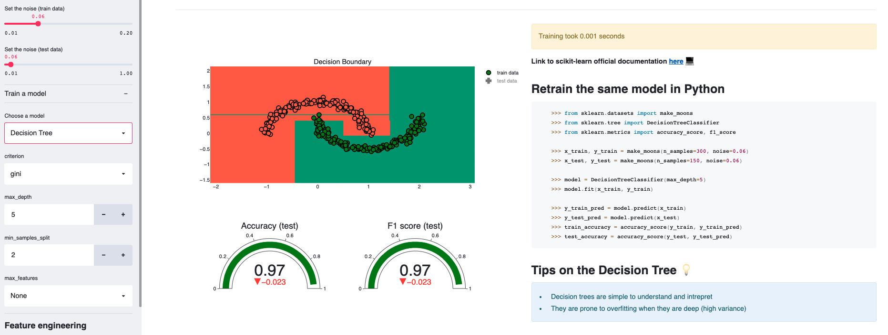
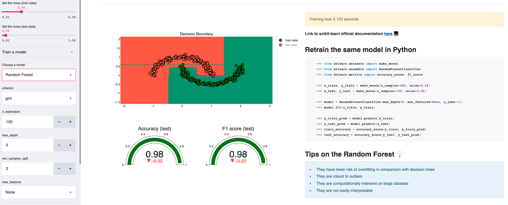
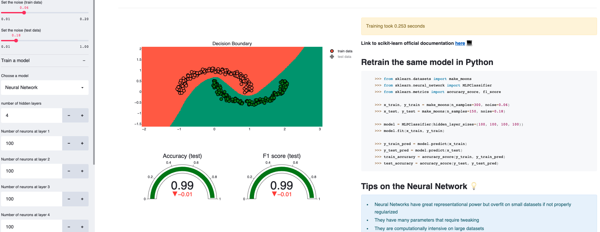

[](https://share.streamlit.io/ahmedbesbes/playground/main/app.py)

*Check my video tutorial to learn how to build this app*

[](https://youtu.be/htKmCWrFYr8 "End to end tutorial to Build and Deploy a Streamlit Application on Heroku")

# Playground 🧪

Playground is a **streamlit** application that allows you to tinker with machine learning models from your browser.

So if you're a data science practitioner you should definitely try it out :wink:

_This app is inspired by the great Tensorflow [playground](https://playground.tensorflow.org/). The only difference here is that it addresses classical machine learning models_

<p align="center">
   
</p>

## Demo

Right [here](https://playground-ml.herokuapp.com/)

## How does it work ?

1. 🗂️ You pick and configure a **dataset** from a pre-defined list. You can set:
   - the number of samples
   - the noise on train and test data
2. ⚙️ You select a **model** set its hyper-parameters. You can pick a model from: Logistic regression, decision tree, random forests, gradient boosting, neural networks, Naive Bayes, KNNs and SVM
3. 📉 The app automatically displays the following results:
   - the decision boundary of the model on train and test data
   - the performance metrics (Accuracy and F1 score) on train and test data
   - the time it took the model to train
   - a generated python script to reproduce the model based on the dataset definition and the model hyper-parameters
4. For each model, playground provides a link to the official documentation as well as a list of tips.

**Bonus point**: the app also provides the ability to perform feature engineering by adding polynomial features. This proves to be helpful for linear models such as logistic regressions on non-linear problems.

## What can you learn from playground?

If you're new to machine learning, playing with this app will probably (and hopefully :smile:) get you familiar with basic notions and help you build your first intuitions. It won't replace text books: it's only meant to complement your knowledge. Take it as it is.

### 1. Decision boundaries will (partially) tell you how models behave

You'll get more sense of how each model works by inspecting its decision boundary. For educational purposes, playground will process datasets that have 2 features (but same results can be obtained on multi-dimensional datasets after dimensionality reduction)

You'll see for example that a logistic regression separates the data by a line (or a hyperplane in the general case)



whereas a decision tree, who classifies the data based on successive conditionals on the values of the features, has a decision boundary composed of horizontal and vertical lines.



Interestingly, a random forest, which is a bagging of multiple decision trees, has a decision boundary that looks similar to the decision tree's but only **smoother**: this is result of the voting mechanism a random forest uses.



### 2. You'll get a sense of the speed of each model

Given the same dataset, you can compare the speed of each model and get a feeling of who's faster. In the previous plots, the logistic regression and the decision tree respectively took **0.004** and **0.001** seconds to train whereas the random foest took **0.154 seconds**.

Try a Neural Network with 4 stacked layers of 100 neurons each: it takes **0.253 seconds**



### 3. Feature engineering can help

Using a logistic regression on the moon dataset won't get you a good score given its non-linear nature.

However, increasing the dimensionality by adding polynomial features can help: try increasing the polynomial degree to 3 when using a logistic regression and notice how the decision boundary radically changes.


### 4. Some models are more robust than others to noise

You can experiment by setting a higher noise on the test data, thus making it drift from the train distribution. Some models such as Gradient Boosting are more stable than others against this problem.

### 5. Try out different combinations of hyper-parameters

A great way to learn and validate your intuitions is to experiment, and that's what this app is for: it'll allow you to tinker with a bunch of hyper-parameters (tree depth, number of estimators, number of layers etc...) and immediately see the results on the decision boundaries, the metrics as well as the execution time.

Go, and give it a try, and I hope you'll learn something from it!

## Run the app locally

Make sure you have pip installed with Python 3.

- install pipenv

```shell
pip install pipenv
```

- go inside the folder and install the dependencies

```shell
pipenv install
```

- run the app

```shell
streamlit run app.py
```

## Structure of the code

- `app.py` : The main script to start the app
- `utils/`
  - `ui.py`: UI functions to display the different components of the app
  - `functions.py`: for data processing, training the model and building the plotly graphs
- `models/`: where each model's hyper-parameter selector is defined

## Contributions are welcome!

Feel free to open a pull request or an issue if you're thinking of a feature you'd like to see in the app.

Off the top of my head, I can think of:

- [ ] Adding other non-linear datasets
- [ ] Adding more models
- [ ] Implementing sophisticated feature engineering (sinusoidal features for instance)
- [ ] Implementing a custom dataset reader with dimensionality reduction
- [ ] Adding feature importance plots

But if you've got other ideas, I will be happy to discuss them with you.
